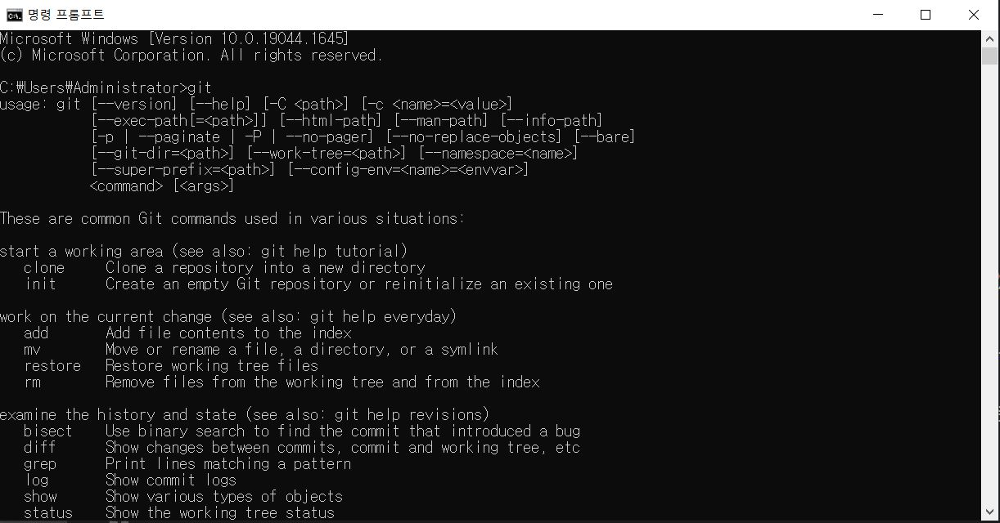

## Intro
형상관리툴인 git-hub를 사용하기 위해서는 여러가지 에디터를 활용하여 연결할 수 있는데,
그전에 가장 기본이 되는 환경설정 먼저 알아보고자 한다. 
### git설치 
<a href="https://git-scm.com/" target="_blank">https://git-scm.com/</a> 에 접속한다. 
본인이 사용하는 운영체제버전에 맞는 것을 다운로드 한다.
설치 후 window에서 cmd창을 열어서 git이라고 입력했을때 아래와 같이 노출된다면 성공이다.

