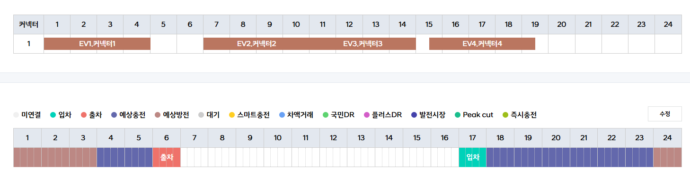
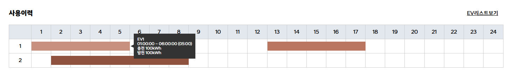

## 사용예시
<br>



---

## 설계 방향  
기존 플러그인(무료/유료)으로는 대응할 수 없는 시각화 스케줄 UI 요구에 따라  
**완전 커스텀 타임라인 플러그인**을 JavaScript 기반으로 직접 설계함.  
옵션 기반 구조로 확장성과 재사용성을 확보하고, 개발자·디자이너 협업을 위한 **가이드 문서**도 함께 제작함.  
**시간 단위 → 분 단위로 세분화된 배치**, 라벨링, 툴팁, 클릭·호버 이벤트까지 지원되는 구조를 통해  
다양한 시나리오에서 유연하게 활용 가능하도록 설계함.

---

## 작업환경  

- 🖥 Frontend: HTML, SCSS, JavaScript (ES6)  
- 📦 Library: None (Vanilla JS), jQuery (일부 대응용)
- 🧰 툴: VS Code, GitHub, Figma  
- 🌐 환경: 웹 표준 / 반응형 / 크로스브라우징 대응

---

## 작업 일정  
- 📅 기간: 2024.07 ~ 2024.08 (약 5주)  
- 👩‍💻 역할: 전체 구조 설계 · 모듈 구현 · 테스트 및 가이드 작성
- ✅ 성과: 총 10+페이지에 적용 / 유료 플러그인비용 월 $345 비용 절감

---

## 문제점  
- 기존 플러그인(무료)은 디자인 커스터마이징이 어렵고,  
  유료 플러그인은 가격 부담(월 345USD)으로 유지 어려움  
- 시간 표시만으로는 부족 → **카테고리 기반 시간 모듈 시각화 필요**  
- 라벨, 툴팁, 이벤트 등 복합 기능 요구에 대응할 수 있는 구조 필요

---

## 해결방안  
- `mkTimeline()` 커스텀 함수 설계: Object 기반 옵션 입력 시 자동 렌더링  
- 시간 축 → 분 단위 정밀 계산 (분 = 100% 기준 환산)  
- 커스텀 라벨 / 카테고리 템플릿 / 분할 그리드 / 배경색 / 모양 지정 등 유연한 스타일 설정 지원  
- 클릭·호버·툴팁 콜백 함수 적용 가능 (옵션 기반)  
- **툴팁 정보 커스터마이징**: `options.tips`를 통한 유저 정의 텍스트 삽입  
- 이벤트 커버 모듈 분리로 **UI + 인터랙션 레이어 이중 분리 처리**

---

## 결과  
- 다양한 페이지와 요구사항에 맞춰 **10+ 화면에 실 적용**  
- **월 $345 유료 플러그인 완전 대체**  
- 타 프로젝트에서도 활용 가능한 가이드 기반 모듈 제공  
- 협업 개발자들이 `object 옵션 → 바로 적용` 가능한 구조로 UX 향상  
- 반응형 대응 및 분 단위 커스터마이징으로 사용처 확장 가능성 확보

---

## 코드 요약 (구조 일부 예시)

```javascript
// 타임라인 렌더링 함수 (DOM + 옵션 기반)
const mkTimeline = (data, dom) => {
  // 테이블 구조 구성
  // 카테고리별 시간 모듈 렌더링
  // 클릭 / 호버 / 툴팁 이벤트 바인딩
};

// 시간 모듈 구성 요소 예시
const timeModule = (data, i, prDom, st, end, realTime) => {
  const hours = Math.abs(st - end);
  const leftSize = /* 시작 위치 계산 */;
  const times = document.createElement('span');
  times.style.width = `${width * hours}px`;
  times.innerText = data[i].label;
  // ...
};
```