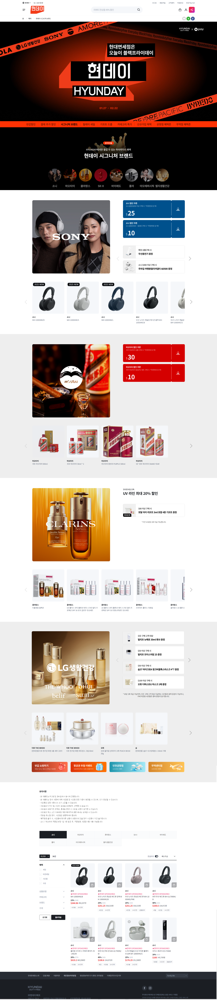

## 설계 방향

**뷰티상품 프로모션 이벤트 랜딩 페이지 퍼블리싱을 진행했으며,  
HTML, CSS, jQuery 기반 UI 구현과 함께 인터랙션 및 API 연동 영역을 작업했습니다.  
베스트 상품 영역은 fetch 기반 API 렌더링 방식으로 퍼블리싱했습니다.**

---

## 작업환경

- 🖥 Frontend: HTML, CSS, jQuery  
- 📦 라이브러리: Swiper  
- 🔗 연동: 쿠폰 발급 API, 베스트 상품 조회 API (fetch)  
- 🌐 환경: 웹 표준 / 반응형 / 크로스브라우징

---

## 작업 일정

- 📅 기간: 약 1주  
- 👩‍💻 역할: 이벤트 랜딩 페이지 퍼블리싱 전담  
- ✅ 성과: 인터랙션 및 API 연동 영역 퍼블리싱 완료

---

### 🖼️ 페이지 특징

- Swiper 기반 상품 슬라이드 인터랙션  
- 쿠폰 발급 버튼 UI 및 상태별 퍼블리싱  
- fetch를 활용한 베스트 상품 API 렌더링  
- PC / 모바일 환경 대응 반응형 레이아웃

---

## 문제점

- API 데이터 수에 따라 상품 영역 레이아웃 변경 가능성  
- 비동기 데이터 로딩 시 초기 UI 공백 발생  
- 모바일 환경에서 슬라이드 개수 대응 필요

---

## 해결방안

- **API 연동을 고려한 리스트 마크업 구조 설계**
  → 데이터 수 변화에도 레이아웃 유지
- **fetch 완료 후 DOM 렌더링 처리**
  → 데이터 로딩 이후 UI 노출
- **Swiper 옵션 분기 처리**
  → 디바이스별 슬라이드 동작 최적화

---

## 주요 구조 요약 (간단 코드)

```js
// 베스트 상품 API fetch (mock API)
fetch('https://api.beautyfreeweek.com/best-items')
  .then(res => res.json())
  .then(data => {
    let html = '';
    data.items.forEach(item => {
      html += `
        <li class="item">
          
          <p class="name">${item.name}</p>
          <p class="price">${item.price}</p>
        </li>
      `;
    });
    document.querySelector('.best-list').innerHTML = html;
  });

// 쿠폰 발급 버튼 인터랙션
$('.coupon-btn').on('click', function () {
  $(this).addClass('issued').text('발급 완료');
});

---

## 결과  
<br>

